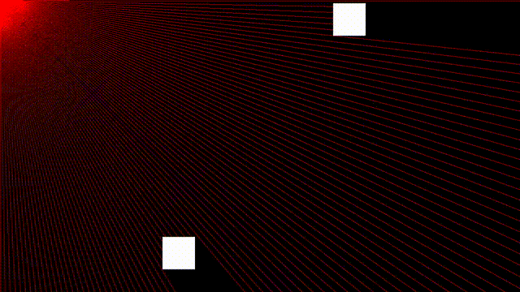

# RayCaster_2D

This is a lightweight 2D ray casting visualization written in C++ with SDL2. A central light source emits rays in all directions, which dynamically stop when colliding with animated rectangular blockers.

